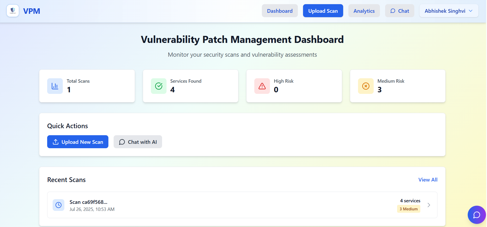
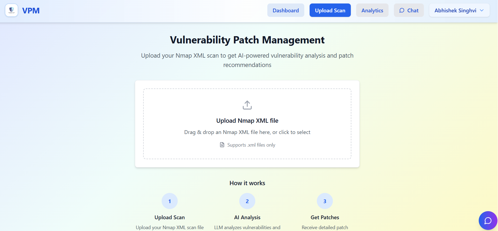
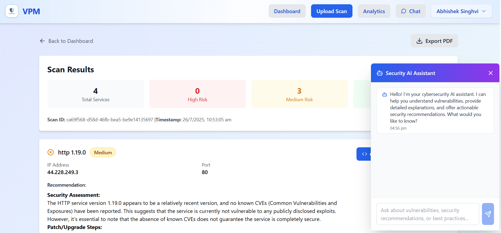
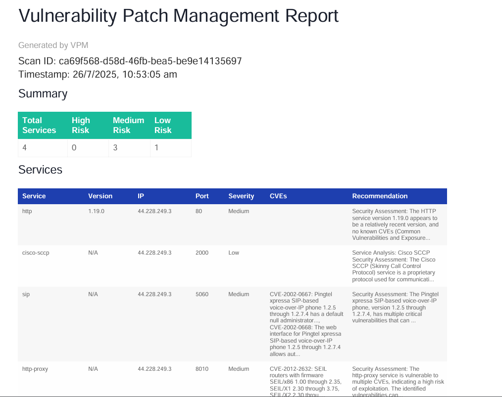

# VPM: Vulnerability Patch Management Platform

VPM is a state-of-the-art platform that leverages Large Language Models (LLMs) to streamline vulnerability patch management. It automates vulnerability detection from Nmap scan data, prioritizes remediation with AI-driven insights, and delivers an intuitive user experience through a modern interface. Built for IT teams, this solution simplifies patch management with real-time analytics, professional reporting, and interactive AI guidance.

**Developed by the Nischay Team for ethical use only. Unauthorized scanning or misuse of this tool is strictly prohibited. Please ensure compliance with all applicable laws and regulations.**

# Demo Video link
  [Google Drive](https://drive.google.com/file/d/1fUBkCLrRg2ZAJJM6RZWODpjA724Pq8nN/view?usp=sharing)

##  Key Features

- **Secure Authentication**: JWT-based login/signup with isolated user data and protected routes.
- **Analytics Dashboard**: Real-time insights with interactive charts, risk breakdowns, and service analytics.
- **AI-Powered Chatbot**: Context-aware security guidance powered by Groq Llama-3 for interactive queries.
- **Professional Reports**: Automated PDF reports with detailed vulnerability analysis and patch recommendations.
- **Core Functionality**:
  - Parses Nmap XML scan files for precise vulnerability detection.
  - Integrates CVE data from the NVD API for real-time threat intelligence.
  - Generates automated patch scripts and severity classifications.
  - Features a responsive React frontend with Tailwind CSS for seamless navigation.

## Project Structure

```
VPM/
├── backend/
│   ├── main.py              # FastAPI backend server
│   ├── requirements.txt      # Python dependencies
│   └── README.md           # Backend setup instructions
├── frontend/
│   ├── src/
│   │   ├── components/     # React components
│   │   │   ├── Dashboard.jsx      # Analytics dashboard
│   │   │   ├── FileUpload.jsx     # File upload component
│   │   │   ├── Navbar.jsx         # Navigation bar
│   │   │   ├── ScanResults.jsx    # Scan results display
│   │   │   └── Chatbot.jsx        # AI chatbot component
│   │   ├── App.jsx         # Main app component
│   │   └── index.css       # Tailwind styles
│   ├── package.json        # Node.js dependencies
│   ├── vite.config.js      # Vite configuration
│   └── tailwind.config.js  # Tailwind configuration
├── examples/
│   └── sample_nmap.xml     # Sample Nmap XML for testing
└── README.md              # This file
```

## Screenshots

### DashBoard



### File Upload Interface

*Description*: A drag-and-drop interface for uploading Nmap XML scan files, featuring real-time validation and progress tracking.

### AI Chatbot Interface

*Description*: An interactive chatbot interface powered by Groq Llama-3, providing context-aware security guidance and answers to user queries.

## Installation

### Prerequisites

- Python 3.8+
- Node.js 16+
- Nmap (for generating scan files)
- Groq API key (for LLM integration)

### Backend Setup

1. **Navigate to the backend directory**:

   ```bash
   cd backend
   ```
2. **Install dependencies**:

   ```bash
   pip install -r requirements.txt
   ```
3. **Set up environment variables**: Create a `.env` file in the `backend` directory with:

   ```plaintext
   GROQ_API_KEY=your_groq_api_key_here
   ```
4. **Start the backend server**:

   ```bash
   python main.py
   ```

   The server runs on `http://localhost:8000`.

### Frontend Setup

1. **Navigate to the frontend directory**:

   ```bash
   cd frontend
   ```
2. **Install dependencies**:

   ```bash
   npm install
   ```
3. **Start the development server**:

   ```bash
   npm run dev
   ```

   The frontend runs on `http://localhost:3000`.

### Optional: Docker Deployment

1. **Build and run**:

   ```bash
   docker-compose up --build
   ```

   This sets up both backend and frontend in a containerized environment.

## Usage Guide

1. **Register & Log In**:
   - Sign up with a username, email, and password via the login page.
   - Log in to access secure, user-specific features.
2. **Generate Nmap Scan**:
   - Run an Nmap scan with vulnerability scripts to generate an XML file:

     ```bash
     nmap -sV --script vulners example.com -oX filename.xml
     ```

     Alternatively, use the `vuln` script for comprehensive vulnerability scanning:

     ```bash
     nmap -sV --script=vuln <target ip> -oX filename.xml
     ```

     **Warning**: Ensure you have permission to scan the target. Unauthorized scanning is illegal and unethical.
3. **Upload Scans**:
   - Use the drag-and-drop interface to upload the generated Nmap XML scan file.
   - The system automatically parses files and provides AI-driven vulnerability analysis.
4. **Explore Dashboard**:
   - View real-time statistics, risk trends, and service analytics.
   - Interact with charts for timeline and risk breakdowns.
5. **Engage with AI Chatbot**:
   - Query the AI for context-aware security advice and patch guidance.
6. **Generate Reports**:
   - Export professional PDF reports with detailed vulnerability insights.
   - Download automated patch scripts for quick remediation.
   - **Sample Report**:

     *Description*: A professionally formatted PDF report showcasing vulnerability details, risk assessments, and AI-generated patch recommendations.

## API Endpoints

- **Authentication**:
  - `POST /api/register`: Create a new user account.
  - `POST /api/login`: Log in and receive a JWT token.
  - `GET /api/me`: Retrieve current user details.
- **Scan Management**:
  - `POST /api/parse-scan`: Upload and parse Nmap XML files.
  - `GET /api/scan/{scan_id}`: View specific scan results.
  - `GET /api/scans`: List all user scans.
  - `DELETE /api/scan/{scan_id}`: Remove a scan.
- **Scripts & Reports**:
  - `POST /api/generate-script/{scan_id}`: Generate patch scripts.
- **Analytics**:
  - `GET /api/stats/summary`: Fetch user statistics.
  - `GET /api/stats/timeline`: Retrieve timeline data.
  - `GET /api/stats/top-services`: View top vulnerable services.
- **AI Chat**:
  - `POST /api/chat`: Interact with the AI chatbot.

## User Interface

- **Dashboard**: Interactive charts and real-time analytics for vulnerabilities and risks.
- **File Upload**: Drag-and-drop interface with validation and progress tracking.
- **Scan Results**: Detailed views of services, CVEs, and severity levels.
- **AI Chatbot**: Real-time, context-aware security guidance.
- **PDF Reports**: Professionally formatted exports with comprehensive vulnerability details.

## Deployment

### Backend (Production)

```bash
pip install gunicorn
gunicorn main:app -w 4 -k uvicorn.workers.UvicornWorker --bind 0.0.0.0:8000
```

### Frontend (Production)

```bash
npm run build
npm install -g serve
serve -s dist -l 3000
```

## 🔐 Security Features

- **JWT Authentication**: Secure, token-based access control.
- **Data Isolation**: User-specific data separation.
- **CORS Protection**: Secure frontend-backend communication.
- **Input Validation**: Robust checks for all inputs.
- **Secure Configuration**: Environment variables for sensitive data.

## 📊 Sample Output

- **Service Analysis**: Details IP, port, service name, and version.
- **CVE Integration**: Real-time vulnerability data from NVD.
- **AI Recommendations**: Patch instructions powered by Groq Llama-3.
- **Severity Levels**: High, medium, and low risk classifications.
- **Analytics**: Trends, top services, and risk summaries.
- **Reports**: Professional PDFs with actionable insights.

## 🎯 Hackathon Deliverables

- **Authentication**: Secure JWT-based user management.
- **Scan Parsing**: Robust Nmap XML processing.
- **LLM Integration**: AI-driven patch recommendations.
- **Analytics Dashboard**: Real-time insights and visualizations.
- **AI Chatbot**: Interactive security guidance.
- **PDF Reports**: Professional, exportable vulnerability reports.
- **Patch Scripts**: Automated remediation scripts.
- **Modern UI/UX**: Intuitive, responsive interface.

## Technologies

- **Backend**: FastAPI, Groq Llama-3, NVD CVE API, JWT, Pydantic.
- **Frontend**: React 18, Vite, Tailwind CSS, Recharts, jsPDF.
- **Authentication**: JWT, bcrypt, OAuth2.

## Future Enhancements
- Integrate directly with scanners like Nmap and Nessus for live, automated data collection.
- Automate patch deployment using tools like Ansible and connect with ticketing systems like Jira.
- Incorporate real-time threat intelligence feeds to prioritize actively exploited vulnerabilities.
- Introduce role-based access control (RBAC) and team features for better collaboration.
- Map vulnerabilities to compliance frameworks like PCI-DSS and HIPAA for automated reporting.

## License

Developed for hackathon purposes by the Nischay Team. See `LICENSE` for details.

**Ethical Use Warning**: This tool is intended for authorized use only. Unauthorized scanning or misuse violates ethical and legal standards. The Nischay Team is not responsible for any misuse of this software.

---

**Secure your infrastructure with VPM: AI-driven vulnerability management made simple and effective!**

*Crafted by the Team Nischay for the hackathon to address modern cybersecurity challenges with innovation and precision.*
